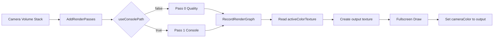
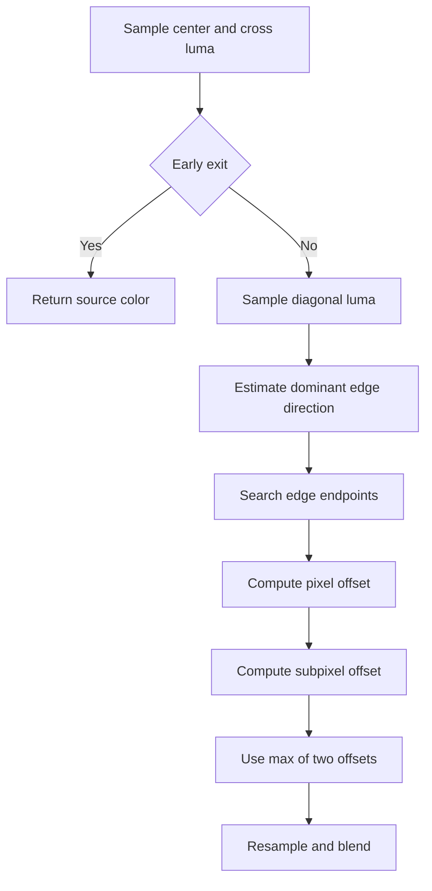

# FXAA（URP RenderFeature 版）技术文档

## TL;DR
- 目标：在 URP 中提供可切换的 FXAA 抗锯齿路径，并通过 Volume 在运行时选择 `Quality` 或 `Console`。
- 核心思路：`Volume` 提供参数与路径开关，`RenderFeature` 每帧读取 Volume 混合值，选择材质 Pass（0/1）并通过 `MaterialPropertyBlock` 传参，`Shader` 双 Pass 分别实现 Quality 与 Console 算法。
- 主要收益：
  - 路径切换在 C# 层完成（静态 Pass 选择），避免单 Pass 运行时分支。
  - 保持 RenderGraph 的资源合法读写（ping-pong 输出，不读写同一目标）。

## 术语说明
- FXAA（Fast Approximate Anti-Aliasing）：后处理抗锯齿算法，通过检测亮度边缘并重采样减弱锯齿。
- Quality 路径：FXAA 质量版，包含方向判定、沿边搜索、子像素偏移等更完整流程。
- Console 路径：更便宜的方向性模糊路径，采样更少、速度更快。
- Ping-pong：从源颜色读，写入新纹理，再把新纹理设为后续活动颜色。

## 1. 文档范围
- 模块路径：
  - `Assets/YukiLibrary/Rendering/RenderFeature/FXAA/RenderfeatureFXAAVolume.cs`
  - `Assets/YukiLibrary/Rendering/RenderFeature/FXAA/RenderfeatureFXAA.cs`
  - `Assets/YukiLibrary/Rendering/RenderFeature/FXAA/FXAA.shader`
- 包含内容：FXAA 的参数入口、渲染链路、Quality/Console 双路径算法与切换机制。
- 不包含内容：
  - TAA/SMAA 等其他 AA 算法。
  - UI 排除策略与 camera stack 特化策略。
  - 自动质量分档策略（按平台自动切 Pass）。
- 读者对象：渲染程序、技术美术。
- 基线版本：URP `17.3.0`（`Packages/manifest.json:8`）。

## 2. 问题与目标
- 问题现象：
  - 需要同时支持 Quality 与 Console 两种 FXAA 路径。
  - 希望用 Volume 实时切换，而不是改材质资源。
- 根因判断：
  - 若只做单 Pass 运行时分支，会增加 shader 体积与寄存器压力。
  - 若读写同一 `activeColorTexture`，RenderGraph 资源依赖不合法。
- 目标指标：
  - Volume 开关可实时切换 FXAA 路径。
  - RenderGraph 通过 ping-pong 合法执行。
  - 参数链路统一：Volume -> RenderFeature -> Shader。
- 非目标：
  - 复刻官方 `FXAA3_11.hlsl` 的全部宏体系。

## 3. 方案概览
### 3.1 核心思路
在 `RenderfeatureFXAA` 中按 Volume 开关选择 shader pass：`Pass0=Quality`、`Pass1=Console`。

### 3.2 关键改动点
- Volume 增加 `useConsolePath` 开关，作为路径选择源（`RenderfeatureFXAAVolume.cs:29`）。
- RenderFeature 在 `AddRenderPasses` 中选择 pass index，并校验有效性（`RenderfeatureFXAA.cs:103`、`RenderfeatureFXAA.cs:106`）。
- Shader 拆分成双 Pass，分别绑定 `FragQuality` 与 `FragConsole`（`FXAA.shader:416`、`FXAA.shader:430`）。

### 3.3 适用与不适用
- 适用：
  - 需要同一效果在“画质优先/性能优先”之间切换。
  - 需要 Volume 混合参数驱动后处理。
- 不适用：
  - 需要时域稳定（运动矢量驱动）的抗锯齿需求（应考虑 TAA）。

## 4. 架构与边界
- 上游调用方：URP 渲染管线在 `AfterRenderingPostProcessing` 注入点调用 RendererFeature（`RenderfeatureFXAA.cs:21`、`RenderfeatureFXAA.cs:112`）。
- 下游依赖：
  - `VolumeManager`（读取 FXAA 参数）
  - `RenderGraph`（创建输出纹理、记录 pass）
  - FXAA 材质与 shader
- 边界定义：
  - 本模块负责：后处理 FXAA、路径切换、参数透传。
  - 不负责：相机是否启用后处理、其他后处理顺序策略。

## 5. 核心流程
### 5.1 主流程（端到端）
1. 从 `VolumeManager` 读取 `FXAAVolume` 参数（`RenderfeatureFXAA.cs:97`）。
2. 根据 `useConsolePath` 选择 pass index（Quality=0, Console=1）（`RenderfeatureFXAA.cs:103`）。
3. RenderGraph 中读取 `activeColorTexture`，创建 `destination` 输出纹理（`RenderfeatureFXAA.cs:204`、`RenderfeatureFXAA.cs:208`）。
4. 执行全屏 pass，shader 按 pass 固定走 `FragQuality` 或 `FragConsole`。
5. 将 `destination` 写回 `resourceData.cameraColor` 供后续 pass 使用（`RenderfeatureFXAA.cs:222`）。

### 5.2 分支流程与条件
- `volume.useConsolePath = false` -> `Pass0 / FragQuality`。
- `volume.useConsolePath = true` -> `Pass1 / FragConsole`。
- `resourceData.isActiveTargetBackBuffer = true` -> 跳过 FXAA（`RenderfeatureFXAA.cs:197`）。

## 6. 关键接口与数据
- 入口接口：
  - `RenderfeatureFXAA.AddRenderPasses(...)`：每相机决定是否执行与选择路径。
  - `FXAAPass.RecordRenderGraph(...)`：登记纹理读写与 pass 执行。
- 外部契约：
  - 输入：`_BlitTexture`（当前相机颜色）、Volume 参数。
  - 输出：FXAA 后颜色纹理（回写 `cameraColor`）。
- 核心数据与状态：
  - Volume 参数：`intensity/subpix/edgeThreshold/edgeThresholdMin/useConsolePath`。
  - RenderGraph 临时纹理：`_RenderfeatureFXAAOutput`（`RenderfeatureFXAA.cs:130`）。

## 7. 实现要点
- 关键实现路径：
  - 参数读取：`FXAAVolume` -> `RenderfeatureFXAA.Setup`。
  - 参数写入：`MaterialPropertyBlock.SetFloat(...)`（`RenderfeatureFXAA.cs:327`~`329`）。
  - 资源生命周期：本帧创建 `destination`，当帧后续 pass 消费。
- 参数与开关：
  - `intensity`：最终与原图混合强度。
  - `subpix/edgeThreshold/edgeThresholdMin`：Quality 与 Console 都会影响早退/平滑强度。
  - `useConsolePath`：C# 层路径选择，非 shader 分支。
- 兼容性与约束：
  - 依赖 URP RenderGraph 与中间纹理。
  - BackBuffer 活动目标时不作为输入采样。

## 7A. 实现细节（图形学）
- 算法主路径：
  - Quality：`IsEarlyExit` -> 方向判定 -> 沿边搜索 -> 子像素偏移 -> 重采样。
  - Console：`IsEarlyExit` -> 对角梯度方向估计 -> 2/4 tap 方向滤波。
- 核心计算（伪代码）：
```text
if range < max(edgeThresholdMin, rangeMax * edgeThreshold):
    return source

if quality:
    edgeDir = estimateEdgeDirection(3x3 luma)
    endpointN/P = searchAlongSpan(edgeDir, presetSteps)
    pixelOffset = endpointToOffset(endpointN/P)
    subpixOffset = estimateSubpixel(3x3 luma)
    finalUV = uv + max(pixelOffset, subpixOffset) * edgeDir
else: # console
    dir = gradientFromDiagonal(2x2)
    rgbA = sample(uv + dir * {-1/6, +1/6})
    rgbB = mix(rgbA, sample(uv + dir * {-1/2, +1/2}))
    choose rgbA/rgbB by luma clamp
```
- 高频信息处理：
  - 早退阈值抑制低对比区域误处理（`FXAA.shader:157`、`FXAA.shader:169`）。
  - Console 路径使用 `dirReduce` 稳定短边与噪声（`FXAA.shader:337`）。
- 质量分档：
  - 当前仅 Quality 路径内有 `FXAA_QUALITY_PRESET`（10~15）步进档位（`FXAA.shader:21`、`FXAA.shader:41`）。
  - Console 路径固定采样模式，成本更稳定。
- 参数影响链路：
  - `subpix ↑` -> 子像素锯齿降低 -> 细节更柔。
  - `edgeThreshold ↑` -> 触发像素减少 -> 更快但残留锯齿可能增加。
  - `edgeThresholdMin ↑` -> 暗部更易早退 -> 暗部锯齿可能回升。

## 8. 效果与性能
- 画面变化：
  - Quality：斜线与细边更稳定，代价更高。
  - Console：更快，边缘细节保真略低。
- 代价与副作用：
  - 两路径都会对高频纹理有一定柔化。
  - Console 在高对比细节区域更容易保留轻微锯齿。

## 9. 错误处理与风险
- 错误类别：
  - 材质缺失或 pass index 非法 -> 警告并跳过（`RenderfeatureFXAA.cs:75`、`RenderfeatureFXAA.cs:108`）。
  - BackBuffer 作为输入 -> 警告并跳过（`RenderfeatureFXAA.cs:197`）。
- 重试与回退：
  - Volume 关闭或强度为 0 时自动停用（`RenderfeatureFXAAVolume.cs:31`）。
- 当前风险：
  - shader 实际 GPU 指令数需在目标平台用 Frame Debugger/Profiler 确认。

## 10. 接入与验证
- 接入步骤：
1. 确认 `RenderfeatureFXAA` 已挂载到目标 Renderer。
2. 场景 Volume 添加 FXAA 组件并开启 `enable`。
3. 在 Volume 中切换 `useConsolePath` 观察路径切换结果。
4. 用 GPU Profiler 对比两路径开销。
- 默认参数建议：
  - 中高端：`Quality` + `FXAA_QUALITY_PRESET=15`。
  - 移动或弱平台：`Console`。
- 调试方法：
  - Frame Debugger 查看材质 pass index 是否 0/1。
  - 观察 `RenderfeatureFXAA.Main` 的输入输出纹理是否正确。

## 11. 代码证据
- `Assets/YukiLibrary/Rendering/RenderFeature/FXAA/RenderfeatureFXAAVolume.cs:29`：Volume 路径开关 `useConsolePath`。
- `Assets/YukiLibrary/Rendering/RenderFeature/FXAA/RenderfeatureFXAA.cs:103`：C# 层选择 `passIndex`。
- `Assets/YukiLibrary/Rendering/RenderFeature/FXAA/RenderfeatureFXAA.cs:208`：创建 FXAA 输出纹理。
- `Assets/YukiLibrary/Rendering/RenderFeature/FXAA/RenderfeatureFXAA.cs:222`：回写 `cameraColor`（ping-pong）。
- `Assets/YukiLibrary/Rendering/RenderFeature/FXAA/FXAA.shader:416`：`FXAAQuality` pass。
- `Assets/YukiLibrary/Rendering/RenderFeature/FXAA/FXAA.shader:430`：`FXAAConsole` pass。

## 12. 假设与待确认
- 假设：
  - 该模块运行在 URP RenderGraph 路径。
- 待确认问题：
  - 是否需要在不同平台自动切换 `useConsolePath`（当前为手动 Volume）。
  - 是否需要把 `FXAA_QUALITY_PRESET` 暴露为编译变体或平台宏。

## 13. 变更记录
- 2026-02-09：新增 `Volume` 路径切换，shader 改为双 Pass（Quality/Console），RenderFeature 改为按 pass index 选择。

## 附录 A：渲染链路图


## 附录 B：Quality 路径步骤图

